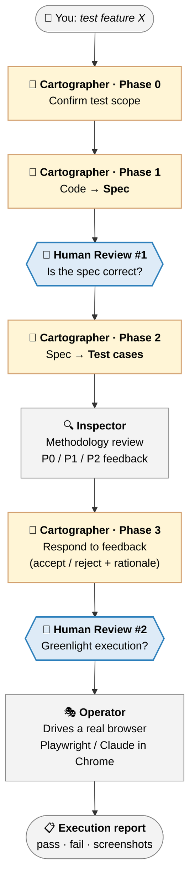

<div align="center">

# spec-test.skill

**A Claude skill for rigorous, end-to-end testing of web applications.**

*Three cooperating agents · Two human review gates · Real-browser execution*

[](https://github.com/Loveforwa/spec-test.skill)
[](#-editions)
[](https://github.com/Loveforwa/spec-test.skill/releases)
[](#-contributing)

[**Download**](#-install) · [**How it works**](#-how-it-works) · [**Contribute**](#-contributing) · [**中文**](#中文)

</div>

---

> A disciplined workflow that turns *"write some E2E tests"* into a structured pipeline:
> read code → write a spec → derive test cases → review against testing methodologies → run in a real browser → produce an evidence-backed report.
>
> *把"写点 E2E 测试"这件事变成一套有方法论的流程:读代码 → 写规约 → 推导用例 → 方法论审用例 → 真实浏览器执行 → 出带证据的报告。*

---

## ⚡ Install

**The fastest path:** grab the pre-built English `.skill` bundle from the latest release and drag it into Cowork's skill installer (or extract it into `~/.claude/skills/`).

<div align="center">

### [📥 Download `spec-test.skill`](https://github.com/Loveforwa/spec-test.skill/releases/latest/download/spec-test.skill)

*One file. Drop it in. Done.*

</div>

<details>
<summary><b>Other install methods</b> — clone the repo, use the Chinese edition, or build from source</summary>

<br>

**Clone and copy the edition you want:**

```sh
git clone https://github.com/Loveforwa/spec-test.skill.git
# English edition
cp -r spec-test.skill/en /path/to/your/skills/spec-driven-test
# Or Chinese edition (中文版)
cp -r spec-test.skill/zh /path/to/your/skills/spec-driven-test
```

**Build the `.skill` bundle yourself:**

```sh
git clone https://github.com/Loveforwa/spec-test.skill.git
cd spec-test.skill
./scripts/build-skills.sh           # builds both editions
./scripts/build-skills.sh en        # English only
./scripts/build-skills.sh zh        # Chinese only
# Output: dist/spec-test.skill (English) and dist/spec-test-zh.skill (Chinese)
```

</details>

---

## 🎯 What it does

`spec-driven-test` orchestrates **three Claude agents** behind **two human review gates** to test one feature of a web app, end to end:

|  | Stage | Driven by | Output |
|---|---|---|---|
| 1 | Confirm scope | Cartographer · Phase 0 | Agreed test boundary |
| 2 | **Spec** | Cartographer · Phase 1 | Structured feature spec |
| 🛂 | **Human Review #1** | *You* | Spec confirmed correct |
| 3 | **Test cases** | Cartographer · Phase 2 | Concrete TCs (steps + expected outcomes) |
| 4 | Methodology review | Inspector | P0 / P1 / P2 graded feedback |
| 5 | Adjudication | Cartographer · Phase 3 | Accept / reject each item, with rationale |
| 🛂 | **Human Review #2** | *You* | Greenlight to execute |
| 6 | Execution | Operator | Real-browser run with screenshots |
| 7 | Report | Operator | Pass / fail report + evidence |

Each agent has a deliberately **limited view** of the world. That isolation is what keeps the review honest — Inspector can't rationalize away a flawed test case by glancing at the code, and Operator can't take API shortcuts that hide a broken UI.

---

## 🔍 How it works



### The three agents and their boundaries

| Agent | Role | Sees | Deliberately doesn't see |
|---|---|---|---|
| 📐 **Cartographer** | Map maker | Code + spec + test cases + feedback | *(no restriction — but isolated from execution)* |
| 🔍 **Inspector** | Reviewer | Spec + test cases + methodologies | **Code** — so review is grounded in spec, not implementation |
| 🎭 **Operator** | Real-user simulator | Test cases + browser state | **Spec design intent** — and must drive the UI; **no API/SQL shortcuts** for the trigger action |

### Operator's hybrid execution

For each test case, Cartographer marks one execution mode based on what the test is actually checking:

| Mode | Best for | How |
|---|---|---|
| 🤖 **Playwright** | Data flow, regression, business logic | Generates `.spec.ts`, runs deterministically |
| 👁️ **LLM browser** | Visual / UX / rendering / exploratory | LLM drives the browser, judges via screenshots |
| ⚖️ **Hybrid** *(default)* | Chatbot / CRUD / dashboard / most things | Playwright runs the flow + saves screenshots at checkpoints, LLM judges the screenshots |

### What you actually do as the human

Two things, in two places: **review the spec** at gate #1, **review the test cases** at gate #2. Everything else — code reading, spec writing, methodology selection, test design, browser driving, report writing — is on the agents.

### What you get out

A **spec document**, a **test case document**, and an **execution report** (with screenshots) — all in markdown, all in your repo, all rerunnable.

---

## 💡 Why this exists

E2E testing is the layer most often skipped by small teams and solo developers. Writing good tests by hand is slow; "vibe-coded" tests miss the unhappy paths; and there's no QA team to backstop you.

This skill gives one developer the rigor of a dedicated QA process — structured specs, methodology-driven test design, real-browser execution, reproducible reports — **without** actually needing a QA team.

---

## 📚 Editions

The skill ships in two **content-equivalent** editions. Pick whichever language your team works in.

| Edition | Path | Prebuilt bundle | Best for |
|---|---|---|---|
| 🇬🇧 **English** | [`en/`](./en) | ✅ [Latest release](https://github.com/Loveforwa/spec-test.skill/releases/latest) | English-speaking teams, international collaboration |
| 🇨🇳 **中文** | [`zh/`](./zh) | Build with `./scripts/build-skills.sh zh` | 团队用中文写规约和评审 |

Each edition is a complete skill: `SKILL.md`, `references/` (agent rulebooks, testing methodologies, scenario patterns), `templates/`, and `examples/`.

> **Note:** the prebuilt download in Releases is the **English** edition. The Chinese edition lives in source in `zh/`; build it locally with the script above if you want a `.skill` bundle.

---

## 🤝 Contributing

This skill is a living document. **If you have a reasonable suggestion, we'll adopt it.**

That includes — but isn't limited to:

- 🐛 Bugs you hit running the workflow on a real project
- ✏️ Wording that's unclear, ambiguous, or wrong
- 🧩 Missing scenario patterns — features whose patterns aren't covered
- 📐 Methodology references that could be clearer or more accurate
- 🌐 Translation parity issues between the two editions
- 📝 New examples drawn from real projects
- 🛠️ Improvements to templates

### How to send feedback

| You have… | Send it via |
|---|---|
| 🐛 A bug or usage issue | [Open an Issue](https://github.com/Loveforwa/spec-test.skill/issues/new) — what you tested, which agent, what happened, what you expected |
| 💡 An improvement idea | An Issue with the `enhancement` label, **or** a Pull Request |
| 🌐 A translation fix | Pull Request — please update **both** `en/` and `zh/` so editions stay in sync |
| 📝 A real-world example | Pull Request to `en/examples/` **and** `zh/examples/` |

We're a small project. **Feedback and PRs from anyone are appreciated and will be taken seriously.**

---

<a id="中文"></a>

## 中文

> Cowork 用户用中文工作?直接克隆仓库,把 [`zh/`](./zh) 这份当 skill 用,或者跑 `./scripts/build-skills.sh zh` 本地打成 `.skill`。

### 这个 skill 是做什么的

把"写点 E2E 测试"这件事拆成一套有方法论的流程,由三个 Claude agent 协作完成,中间还有**两道人类 review** 把关:

1. **📐 Cartographer(制图师)** 读你的代码,产出被测功能的**规约**(spec),再把规约翻译成具体的**测试用例**。
2. **🔍 Inspector(检查员)** 用一套测试方法论(边界值分析、等价类划分、决策表、状态迁移、用例测试、Right-BICEP)和场景模式清单审查测试用例,输出 P0 / P1 / P2 分级反馈。
3. **🎭 Operator(执行员)** 在真实浏览器里(Playwright 或 Claude in Chrome)跑每一条测试用例,产出附带截图证据的执行报告。

两道人类 review(规约后 + 用例后)把"规约对不对"和"这是不是我们想跑的用例"留给人判断,其余的繁琐工作交给 agent。

### 工作流程

详细的工作流程图见上方英文章节的 [Mermaid 图](#-how-it-works)(GitHub 会原生渲染)。简化版:

```
你: "测一下功能 X"
   ↓
Cartographer 阶段 0/1  →  规约
   ↓
🛂 Human Review #1
   ↓
Cartographer 阶段 2/2.5  →  测试用例
   ↓
Inspector 方法论审查  →  P0/P1/P2 反馈
   ↓
Cartographer 阶段 3  →  接受/拒绝 + rationale
   ↓
🛂 Human Review #2
   ↓
Operator 真实浏览器执行  →  📋 执行报告 + 截图
```

### 三个 agent 的边界

| Agent | 角色 | 看什么 | 不看什么 |
|---|---|---|---|
| 📐 **Cartographer** | 制图师 | 代码 + 规约 + 用例 + 反馈 | *(无限制)* |
| 🔍 **Inspector** | 检查员 | 规约 + 用例 + 方法论 | **不看代码** —— 保持审查独立性 |
| 🎭 **Operator** | 执行员 | 用例 + 浏览器实际状态 | **不看规约设计意图**;trigger 必须走 UI,**禁止 API / SQL 捷径** |

### Operator 混合执行模式

| 模式 | 适用 | 怎么做 |
|---|---|---|
| 🤖 **Playwright** | 数据流 / 回归 / 业务逻辑 | 生成 `.spec.ts`,确定性执行 |
| 👁️ **LLM 浏览器** | 视觉 / 渲染 / UX / 探索性 | LLM 实时操作浏览器 + 看截图判断 |
| ⚖️ **混合** *(默认)* | chatbot / CRUD / 多数业务功能 | Playwright 跑流程 + 关键节点截图,LLM 后处理判断截图 |

### 你拿到的产出

**规约文档** + **测试用例文档** + **执行报告**(带截图)—— 全是 markdown,可以提交进 git,可以重跑。

### 安装

```sh
git clone https://github.com/Loveforwa/spec-test.skill.git
cp -r spec-test.skill/zh /path/to/your/skills/spec-driven-test
```

或者本地打包成 `.skill`:

```sh
cd spec-test.skill
./scripts/build-skills.sh zh
# 产物:dist/spec-test-zh.skill
```

> Releases 里只发布英文版的预编译 `.skill`。中文版要么直接 clone 用源目录,要么本地打包(中文版 maintainer 容量有限,所以不发预编译包)。

### 贡献

任何合理的反馈和 PR 都会被认真对待。详见上方英文 [Contributing](#-contributing) 章节——交 Issue 写明你测的是什么、跑的哪个 agent、发生了什么、期望什么;改翻译请同步改 `en/` 和 `zh/`。

---

<div align="center">

**Built for small teams · Made with Claude**

*If this skill helps you ship better tests, ⭐ the repo so others can find it.*

</div>
